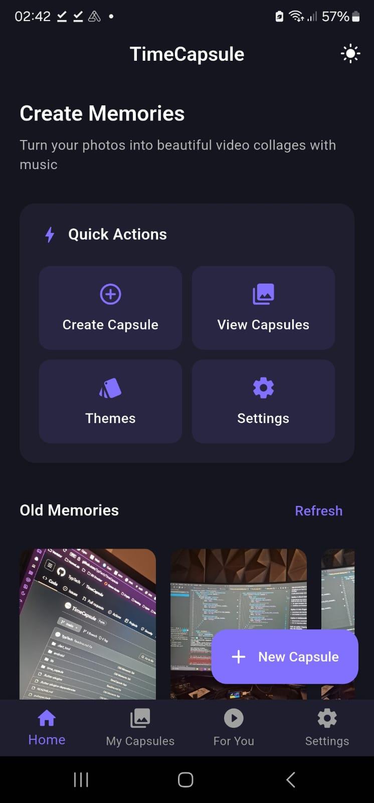
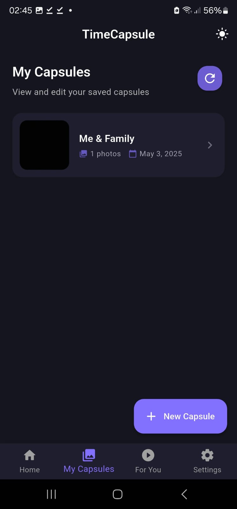
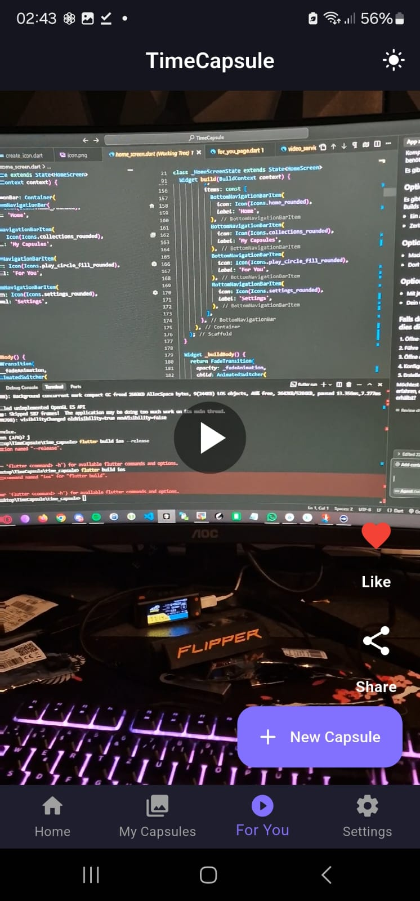
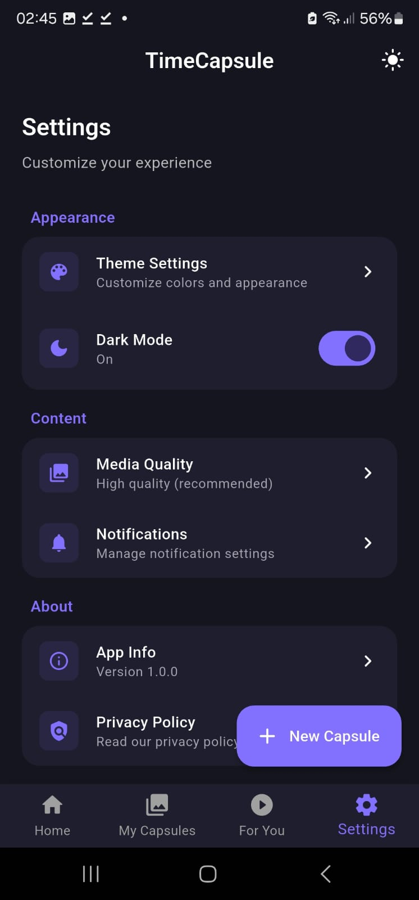

# TimeCapsule

TimeCapsule is a Flutter app that lets you create digital time capsules with photos and memories. The app also features a "For You" section with a TikTok-like interface for browsing videos from your device.

## Features

### Memory Capsules
- Create time capsules with photos from your device
- Add titles, descriptions, and themes to your capsules
- View and manage your saved capsules

### Home Screen
- View old photos from your device and past capsules
- Navigate to create new capsules or view existing ones

### For You Page
- Browse through videos from your device with a TikTok-style interface
- Like/unlike videos to save your favorites
- Swipe navigation for a smooth browsing experience

## Screenshots

Hier sind einige Screenshots der TimeCapsule App:

### Hauptbildschirm


### Zeitkapsel-Erstellung


### For You Seite


### For You Seite


*Hinweis: Um deine eigenen Screenshots hinzuzufügen, erstelle einen 'screenshots' Ordner im Hauptverzeichnis des Projekts und füge deine Bilder hinzu. Aktualisiere dann die obigen Bildpfade entsprechend.*

## Technical Details

### Built With
- Flutter - Cross-platform UI framework
- Hive - Local database for storing capsules and liked videos
- Provider - State management
- Permission Handler - For managing media permissions
- Video Player - For video playback functionality

### Architecture
- The app follows a service-based architecture
- Clear separation between UI and business logic
- Model-View-Controller pattern for state management

## Getting Started

### Prerequisites
- Flutter 3.10.0 or higher
- Dart 3.0.0 or higher
- Android Studio / VS Code with Flutter extension

### Installation

1. Clone the repository
```bash
git clone https://github.com/yourusername/TimeCapsule.git
```

2. Navigate to the project directory
```bash
cd TimeCapsule
```

3. Install dependencies
```bash
flutter pub get
```

4. Run the app
```bash
flutter run
```

## Building for Release

### Android
To build a release APK:
```bash
flutter build apk --release
```

The APK file will be located at `build/app/outputs/flutter-apk/app-release.apk`

### iOS
To build for iOS:
```bash
flutter build ios --release
```

Then use Xcode to create an archive and distribute the app.

## Permissions
The app requires the following permissions:
- Storage access (to read/write photos and videos)
- Camera access (to take new photos)
- Media library access (to browse photos and videos)

## License
*[MIT License](LICENSE)*


### Made with 💕 by TypTech
